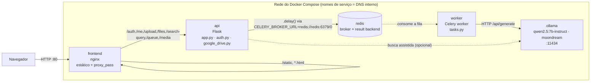

# Por Dentro Do BuscaÁgil

Guia técnico do código: o que cada peça faz, como frontend, api, worker,
Redis, Ollama e o Google Drive conversam entre si dentro do Docker, e
**por que** o projeto foi montado assim — não só o quê, mas o porquê de
cada decisão.

Pra instalar/rodar veja o [README.md](README.md); pra usar o sistema veja o
[GUIA_DE_USO.md](GUIA_DE_USO.md). Este documento é sobre como o código por
dentro funciona.

**Stack**: Flask · Celery 5.4 · Redis · Docker Compose · nginx · Ollama (IA
local) · Gemini API · Google Drive API (OAuth2 manual) · rapidfuzz

Projeto propositalmente simples — sem ORM, sem banco de dados, sem build
step no frontend. A ideia é deixar visíveis os conceitos de sistemas
distribuídos que ele usa de verdade: fila de mensagens, broker, worker,
gateway/reverse proxy — sem framework "corporativo" no meio pra esconder
onde cada peça começa e termina.

## Sumário

1. [Visão geral](#1-visão-geral)
2. [Containers e como eles se falam](#2-containers-e-como-eles-se-falam)
3. [Do clique em "Enviar" até o Drive](#3-do-clique-em-enviar-até-o-drive)
4. [Login com Google e o Drive como storage](#4-login-com-google-e-o-drive-como-storage)
5. [Sem banco de dados: tudo em JSON](#5-sem-banco-de-dados-tudo-em-json)
6. [Classificação: local primeiro, nuvem como rede de segurança](#6-classificação-local-primeiro-nuvem-como-rede-de-segurança)
7. [Motor de busca: um critério, dois lugares](#7-motor-de-busca-um-critério-dois-lugares)
8. [Fila de processamento](#8-fila-de-processamento)
9. [Segurança](#9-segurança)
10. [Frontend: HTML solto, sem build step](#10-frontend-html-solto-sem-build-step)
11. [Mapa de arquivos](#11-mapa-de-arquivos)

---

## 1. Visão geral

BuscaÁgil é um buscador pessoal de arquivos. O usuário entra só com a conta
Google, envia arquivos (ou cola links), e o sistema guarda tudo no
**Google Drive do próprio usuário** — não num servidor nosso — classificando
cada item por IA (categoria, tags, descrição) pra depois ser possível
buscar por assunto, não só por nome de arquivo.

> **Decisão central**: o Drive do usuário é a **fonte da verdade**. O
> BuscaÁgil nunca guarda o conteúdo do arquivo em disco de longo prazo —
> `media/` é só o pouso temporário entre o upload e o envio pro Drive,
> apagado assim que o worker confirma. Isso significa: sem custo de storage
> pro lado do BuscaÁgil, e o usuário nunca perde acesso aos próprios
> arquivos mesmo que o BuscaÁgil saia do ar.

| Onde mora | O quê | Por quê |
|---|---|---|
| Google Drive | Arquivo real + `uploaded_files.json` | Fonte da verdade, dono é o usuário |
| `data/users/<id>/catalog.json` | Cópia do catálogo | Cache local — responde rápido sem bater no Drive a cada tela |
| `data/users/<id>/profile.json` | Tokens OAuth + IDs do Drive + cota | Só o que é infraestrutura da própria sessão do usuário |
| `media/` | Arquivo enviado, por segundos | Pouso temporário até subir pro Drive |

---

## 2. Containers e como eles se falam

Cinco containers sobem via `docker-compose.yml`: `frontend` (nginx),
`api` (Flask), `worker` (Celery), `redis` (broker) e `ollama` (IA local).
Nenhum container de banco de dados.



`frontend` é o único ponto de entrada: serve os HTMLs/CSS/JS estáticos
direto do disco e faz `proxy_pass` das rotas de dados pro serviço `api`
(ver `frontend/nginx.conf`). Do ponto de vista do navegador existe uma
origem só — por isso o cookie de sessão funciona sem precisar configurar
CORS. Esse é o padrão clássico de **gateway/reverse proxy** na frente de
dois sistemas diferentes (estático + api).

`redis` é um container próprio — broker de mensagens que desacopla "o
arquivo chegou" (`api`) de "o arquivo foi classificado e subiu pro Drive"
(`worker`). `api` e `worker` **compartilham a mesma imagem** (mesmo
`Dockerfile`, mesmo código montado via bind mount) — só o comando muda:
`api` roda o Flask, `worker` roda `celery -A worker.celery_app worker`
(ver `worker/entrypoint.sh`).

```yaml
# docker-compose.yml
api:
  command: flask --app api.app run --host=0.0.0.0 --port=5000 --debug
  environment:
    CELERY_BROKER_URL: redis://redis:6379/0

worker:
  entrypoint: ["sh", "/app/worker/entrypoint.sh"]
  environment:
    CELERY_BROKER_URL: redis://redis:6379/0
```

> **Trade-off aceito**: um `redis` só e uma réplica de `worker`. Escalar
> processamento horizontalmente (mais de um worker em paralelo) já
> funciona hoje — todos os workers consomem a mesma fila no mesmo Redis —
> mas não há orquestração de múltiplas réplicas configurada (fica pra
> quando o volume justificar).

---

## 3. Do clique em "Enviar" até o Drive

O upload em si é rápido: o navegador manda o arquivo, a api devolve
`"processing"` na hora e a classificação + envio real pro Drive acontecem
em segundo plano, no worker.

1. **Navegador envia o arquivo via XHR** — `upload.js` usa
   `XMLHttpRequest` (não `fetch`) especificamente pra ter a barra de
   progresso via `xhr.upload.onprogress`.
2. **`POST /upload`** — `api/app.py::upload_files` salva o arquivo em
   `media/` (pouso temporário), cria a entry no catálogo com
   `status="processing"`, e enfileira
   `classify_and_catalog_task.delay(...)` — devolve a resposta pro
   navegador **sem esperar** a classificação terminar.
3. **Celery entrega a tarefa pro worker** — a tarefa vai pra fila no Redis;
   o processo `api` segue livre pra atender outras requisições.
4. **Worker classifica** — `worker/tasks.py::_run_file_upload` chama
   `processar_upload()`: tenta IA local (Ollama) primeiro se habilitada,
   cai pro Gemini em qualquer falha (ver [seção 6](#6-classificação-local-primeiro-nuvem-como-rede-de-segurança)).
5. **Upload real pro Drive** — `google_drive.upload_file()`. Só agora o
   conteúdo sai da máquina que roda o BuscaÁgil e vai pro Drive do usuário.
6. **Catálogo atualizado e sincronizado de volta** —
   `api/stores.py::update_entry()` grava categoria/tags/descrição/confiança
   no cache local; `sync_catalog_to_drive()` sobe o `uploaded_files.json`
   atualizado pro Drive. O arquivo temporário em `media/` é apagado.
7. **Navegador descobre que terminou via polling** —
   `task-notifications.js` consulta `GET /files/<id>/status`
   periodicamente até o status virar `"done"` ou `"error"` — funciona mesmo
   se o usuário sair da tela de upload e navegar pra outro lugar.

> **Por que assíncrono**: classificar por IA (principalmente vídeo, que
> passa por transcrição + várias legendas de cena) pode levar de segundos a
> minutos. Bloquear a requisição HTTP até isso terminar deixaria o
> navegador travado e arriscaria timeout — a fila do Celery desacopla "o
> arquivo chegou" de "o arquivo foi entendido".

```python
# api/app.py
try:
    async_result = classify_and_catalog_task.delay(
        user_id, saved_name, saved_path, uploaded_file.filename
    )
    entry_status = "processing"
except Exception as exc:
    # Broker (Redis) fora do ar não pode fazer o arquivo já salvo em
    # media/ sumir sem deixar rastro — sem isso, a entry nunca era
    # criada e o arquivo ficava órfão, invisível em qualquer tela.
    entry_status = "error"
```

Mesmo a fila do Celery falhando (Redis fora do ar) não pode fazer o upload
desaparecer silenciosamente — o arquivo já está salvo, então a entry é
criada de qualquer jeito, só que com status de erro visível.

---

## 4. Login com Google e o Drive como storage

Não existe usuário/senha do BuscaÁgil, nem tabela de usuários. O login é um
fluxo OAuth2 "authorization code" manual (`google-auth-oauthlib`, ver
`api/auth.py`) — e, crucialmente, **o mesmo consentimento** já pede acesso
a uma pasta no Drive do usuário. Não há uma segunda tela de "autorizar o
Drive".

```python
# api/auth.py
SCOPES = [
    "openid",
    "https://www.googleapis.com/auth/userinfo.email",
    "https://www.googleapis.com/auth/userinfo.profile",
    # drive.file: só dá acesso aos arquivos que o próprio BuscaÁgil cria
    # no Drive do usuário — não enxerga o resto do Drive dele.
    "https://www.googleapis.com/auth/drive.file",
]
```

> **Por que `drive.file`, não `drive`**: o escopo completo (`drive`)
> enxergaria — e poderia apagar — qualquer arquivo do Drive do usuário.
> `drive.file` restringe o app a só os arquivos que ele mesmo criou. É o
> princípio do menor privilégio aplicado a uma integração OAuth: um bug no
> BuscaÁgil não vira um jeito de destruir os documentos pessoais de outra
> parte da vida do usuário.

O "id" de cada usuário é o `sub` (subject) que o próprio Google devolve —
estável e único por conta Google. Não existe autoincremento nem tabela:
esse id **é** o nome da pasta em `data/users/<id>/`.

`GET /auth/callback` (`api/auth.py::callback`) roda assim que o Google
devolve o `code`:

1. **Troca o código por tokens** — `access_token` + `refresh_token`
   (o `refresh_token` só vem porque o pedido usa `access_type=offline` +
   `prompt=consent`; sem isso o worker Celery não conseguiria renovar o
   acesso ao Drive fora do ciclo de vida do login).
2. **Garante a pasta** — `google_drive.ensure_app_folder()` cria
   `buscaagil_upload/` na raiz do Drive se ainda não existir.
3. **Baixa o catálogo** — `download_catalog()` lê o `uploaded_files.json`
   de dentro dessa pasta (se o usuário já usou o sistema noutro
   dispositivo, por exemplo).
4. **Grava tudo em disco** — `stores.write_profile()` (tokens + folder_id
   + cota) e `stores.write_all()` (catálogo) — ver
   [seção 5](#5-sem-banco-de-dados-tudo-em-json).
5. **Abre a sessão** — `session["user_id"] = user_id`: um cookie assinado
   nativo do Flask (`FLASK_SECRET_KEY`), sem nenhum estado de sessão
   guardado no servidor.

Se qualquer passo falhar (token sem escopo, API do Drive fora do ar), o
usuário é redirecionado pra `auth.html` em vez de um erro 500 — com um
botão que força o Google a pedir consentimento de novo.

---

## 5. Sem banco de dados: tudo em JSON

Pergunta natural: se o Drive do usuário já guarda os arquivos, pra que
banco de dados? Resposta curta: **não precisa**. As únicas coisas que
antes viviam num banco (sessão, conta Google, token OAuth, IDs da pasta no
Drive) não são dado de negócio — são só estado de infraestrutura por
usuário, e cabem inteiras em dois arquivos JSON:

```
data/users/<id>/
├── catalog.json   # espelho do uploaded_files.json que vive no Drive
└── profile.json   # tokens OAuth + folder_id + catalog_file_id + cota
```

> **Por que JSON em arquivo, não SQLite/Postgres**: o Drive já *é* a fonte
> da verdade dos arquivos — colocar tudo também numa tabela relacional
> duplicaria a sincronização (Drive ↔ banco) sem necessidade real pro
> volume de um catálogo pessoal (dezenas a milhares de itens, não
> milhões). Sessão vira cookie assinado (Flask cuida disso nativamente,
> sem servidor de sessão); tokens/IDs do Drive são só um dict por usuário.
> Um dict Python lido inteiro na memória é suficiente, e mais simples de
> espelhar 1:1 com o formato que já é salvo no Drive.

O risco óbvio dessa escolha — dois processos (a `api` respondendo ao
polling do navegador, e o `worker` escrevendo o resultado da classificação)
mexendo no mesmo arquivo ao mesmo tempo — é resolvido com um lock por
arquivo:

```python
# api/stores.py
def update_entry(user_id: int | str, entry_id: str, **fields) -> dict | None:
    """Atualiza campos de uma entry existente (usado pelo worker Celery ao
    terminar a classificação/upload assíncronos)."""
    path = _catalog_path(user_id)
    with FileLock(_lock_path(path), timeout=_LOCK_TIMEOUT_SECONDS):
        files = _read_json_file(path, {"files": []}).get("files", [])
        entry = next((f for f in files if f["id"] == entry_id), None)
        if entry is None:
            return None
        entry.update(fields)
        _write_json_file(path, {"files": files})
        return entry
```

`FileLock` (lib `filelock`) garante que o "ler tudo → alterar um item →
reescrever tudo" seja atômico entre processos — sem isso, uma leitura do
polling no meio de uma escrita do worker poderia corromper o JSON ou
perder uma edição.

> **Trade-off aceito**: sem índice nem consulta SQL — toda busca/filtro é
> `O(n)` sobre a lista completa carregada em memória (ver
> [seção 7](#7-motor-de-busca-um-critério-dois-lugares)). Ótimo pra um
> catálogo pessoal; não escalaria pra um catálogo compartilhado de milhões
> de arquivos.

---

## 6. Classificação: local primeiro, nuvem como rede de segurança

Todo arquivo (ou link) enviado passa por `scripts/processar_upload.py`,
que tenta classificar com Ollama (container local, grátis, sem sair da
máquina) e só cai pro Gemini (API paga/cota) se a IA local estiver
desligada ou falhar. Esse módulo não depende de Flask/Django nenhum — é
chamado tanto pelo `worker` (classificação de verdade) quanto poderia ser
testado isolado via `python -m scripts.processar_upload`.

| Formato | Caminho Ollama (local) | Caminho Gemini (nuvem) |
|---|---|---|
| Texto / planilha / docx | Extraído como texto, classificado direto | Igual |
| Imagem / PDF | **2 etapas**: `moondream` gera legenda em texto → modelo de texto classifica a legenda | 1 etapa: Gemini processa o arquivo nativo direto |
| Vídeo / áudio | `faster-whisper` (`small`) transcreve + 3 frames legendados por `moondream` | Não suportado — capacidade só da IA local |
| Link do YouTube | Título/canal (oEmbed) + transcrição/legenda real do vídeo (`youtube-transcript-api`) | Igual |
| Link genérico | Título + meta-descrição da página, priorizados antes do corpo | Igual |

> **Por que 2 etapas na visão local**: `moondream` é um modelo de visão
> pequeno (~1.8B, roda em CPU) — leve demais pra seguir com confiança um
> schema JSON. Em vez disso, ele só descreve a imagem em texto livre, e
> essa legenda é classificada pelo mesmo prompt/modelo de texto
> (`qwen2.5:7b-instruct`) usado pra documentos — reaproveitando um único
> "classificador de texto" pra tudo.

Os dois caminhos (local e Gemini) devolvem exatamente o mesmo formato de
dict — quem chama essa função (`worker/tasks.py`) nunca precisa saber qual
dos dois respondeu.

### Categoria é aberta, não uma lista fixa

Não existe um enum fechado de categorias de negócio. Antes de classificar,
`worker/tasks.py::_known_categories` lê as categorias que o **próprio
usuário** já tem no catálogo e passa isso como referência pro classificador
(`categorias_conhecidas`, ver `scripts/processar_upload.py`) — o prompt
instrui o modelo a reaproveitar uma categoria existente quando fizer
sentido, e só criar uma nova se nenhuma servir. Assim o vocabulário de
categorias nasce do conteúdo real do usuário (qualquer assunto, qualquer
domínio) em vez de forçar tudo num punhado de rótulos genéricos de
back-office.

```python
# scripts/categorizer_gemini.py — trecho do prompt
"Reaproveite uma das 'categorias já usadas' se ela descrever bem o
conteúdo (copie exatamente, mesma grafia/acentuação); só crie uma
categoria nova se nenhuma existente servir."
```

Como reforço além do prompt — um modelo pode ocasionalmente devolver uma
categoria quase-idêntica a uma que já existe (typo, plural, acento) —
`worker/tasks.py::_snap_to_known_category` compara (fuzzy, rapidfuzz) a
categoria devolvida contra as já existentes e troca pela grafia já usada
quando a similaridade é muito alta (`_CATEGORY_SNAP_THRESHOLD = 92`). Isso
evita o catálogo acumular "financeiro", "finanças" e "financeiro pessoal"
como três categorias diferentes por acidente.

### Confiança vira sinal na tela

O modelo (local ou Gemini) responde com uma única `confianca` (0.0–1.0) —
o quanto ele acha que o conteúdo realmente pertence à categoria escolhida
— via *structured output* (schema Pydantic, sem parsing manual de texto
livre). O `worker/tasks.py` guarda isso como `confidence` no catálogo;
quando fica abaixo de `0.55`, um selo laranja aparece na interface
convidando o usuário a revisar, em vez de confiar cegamente numa
classificação duvidosa.

---

## 7. Motor de busca: um critério, dois lugares

A busca combina duas camadas: a IA sugere quais categorias/tags do
catálogo do próprio usuário provavelmente correspondem à consulta
(`scripts/analisador_busca.py`), e um critério de *matching* local decide,
arquivo por arquivo, se isso conta como resultado.

> **Por que existe `api/text_match.py`**: esse critério de match precisa
> rodar em **dois lugares diferentes**: no backend (Python, filtro final de
> `smart_search`) e no frontend (JS, fallback usado quando a query está
> vazia ou a chamada ao backend falha). Ter a lógica implementada duas
> vezes, de formas diferentes, significava que a mesma busca podia dar
> resultados diferentes dependendo de qual caminho respondia — por isso os
> dois lados seguem exatamente o mesmo critério em camadas, só numa
> linguagem diferente (rapidfuzz em Python, Levenshtein escrito à mão em
> JS).

1. **Categoria exata** — categoria do arquivo bate (sem acento/caixa) com
   uma categoria sugerida pela IA → **score 100**.
2. **Tag exata** — uma tag do arquivo bate exatamente com uma tag sugerida
   → **score 98**.
3. **Consulta literal no nome** — a consulta aparece (sem acento/caixa)
   dentro do nome do arquivo → **score 96**, independente do que a IA
   sugeriu. Esse tier existe pra não depender só da IA acertar a
   categoria/tag certa: se a busca já bate no nome do arquivo, isso é sinal
   forte o bastante sozinho (evita falso negativo quando a análise de busca
   é fraca ou falha).
4. **Tag aproximada na descrição/nome** — uma tag sugerida aparece (com
   typo/acento) na descrição ou nome do arquivo → score pelo fuzzy.
5. **Fuzzy geral** — a consulta inteira é comparada, tolerando erro de
   digitação, contra nome + descrição + categoria + tags concatenados —
   com um piso mais alto que os outros tiers
   (`FALLBACK_FUZZY_THRESHOLD = 85`, contra `FUZZY_THRESHOLD = 80` do resto):
   é o tier sem nenhuma âncora específica (não bateu categoria, tag nem
   nome), então precisa de mais confiança pra entrar — sem isso, uma query
   curta batia raso em quase qualquer arquivo (falso positivo).

Resultado abaixo de `80` (de 0–100, `FUZZY_THRESHOLD`) não entra na lista —
e os que entram são **ordenados por esse score**, não pela ordem crua do
catálogo. Como as categorias agora são as reais do usuário (seção 6), a
análise de busca (`known_categories`) tem mais chance de bater com o que
ele de fato guardou, em vez de tentar encaixar contra um enum genérico sem
relação com o conteúdo.

---

## 8. Fila de processamento

`GET /queue` (`api/app.py::queue_status`) expõe o conceito de fila em dois
ângulos ao mesmo tempo — de propósito, pra deixar visível a diferença
entre "estado de negócio" e "fila de mensagens de verdade":

```python
# api/app.py
counts = {"processing": 0, "done": 0, "error": 0}   # lado do catálogo do usuário
pending_in_broker = redis_client.llen("celery")      # lado do broker (Redis)
```

- **`counts`** é derivado do catálogo local (`data/users/<id>/catalog.json`)
  — quantos itens *deste usuário* estão em cada status.
- **`pending_in_broker`** é uma leitura direta no Redis (`LLEN` na fila
  padrão do Celery) — quantas mensagens estão esperando **qualquer**
  worker consumir, de todos os usuários, o dado cru do broker.

A tela `processing.html` mostra os dois lado a lado, com polling a cada
4s — dá pra ver, ao vivo, uma tarefa saindo da fila do broker (`redis`) ao
mesmo tempo em que o item correspondente muda de "processing" pra "done"
no catálogo.

---

## 9. Segurança

### CSRF: cookie na página, token no header

Como as páginas são HTML "soltas" (sem template engine, sem framework por
trás), a proteção CSRF é implementada à mão em `api/csrf.py`: todo GET
recebe um cookie `csrftoken` legível por JS (double-submit cookie); todo
POST precisa mandar esse valor de volta no header `X-CSRFToken`, senão a
api recusa com `403`.

```python
# api/csrf.py
@app.before_request
def _check_csrf():
    if request.method in SAFE_METHODS:
        return None
    cookie_token = request.cookies.get(CSRF_COOKIE_NAME)
    header_token = request.headers.get(CSRF_HEADER_NAME, "")
    if not cookie_token or header_token != cookie_token:
        return jsonify({"success": False, "error": "Token CSRF ausente ou inválido."}), 403
```

```javascript
// static/js/catalog-client.js
function getCsrfToken() {
  const match = document.cookie.match(/(?:^|;\s*)csrftoken=([^;]+)/);
  return match ? decodeURIComponent(match[1]) : "";
}
```

Usado em todo `fetch`/`XMLHttpRequest` que altera dado — upload, adicionar
link, editar classificação, excluir arquivo.

### Sessão sem servidor de sessão

`flask.session` é um cookie assinado (não criptografado, mas à prova de
adulteração) com `FLASK_SECRET_KEY` — nenhum estado de sessão fica
guardado em disco ou banco. Subir com `FLASK_DEBUG=false` sem uma
`FLASK_SECRET_KEY` real não falha silenciosamente:

```python
# api/app.py
if not debug and secret_key == "busca-agil-insecure-dev-key":
    raise RuntimeError(
        "FLASK_DEBUG=false mas FLASK_SECRET_KEY não foi definida — gere uma "
        "chave segura ... antes de rodar em produção."
    )
```

---

## 10. Frontend: HTML solto, sem build step

Não há React/Vue nem bundler. Cada tela é um HTML estático servido direto
pelo nginx, carregando scripts simples via `<script src>` — o "estado" é
um array em memória (`MOCK_FILES`) populado por `fetch` quando a página
abre.

> **Como a página descobre quem está logado**: sem template engine no
> servidor, cada página faz uma chamada **síncrona** a `GET /me` logo no
> topo do `<body>` (antes de qualquer outro script rodar) e guarda o
> resultado em `window.__BUSCA_AGIL_USER__` — substitui o que antes era
> injetado inline pelo servidor. É a mesma ideia, só que buscada pela
> própria página em vez de vir pronta no HTML.

| Função em `catalog-client.js` | Usada por |
|---|---|
| `loadUploadedFiles()` | Toda tela que lista arquivos |
| `smartSearchFiles()` | dashboard, busca dedicada |
| `searchFiles()` (fallback local com fuzzy) | quando a busca no backend falha/está vazia |
| `isLowConfidence()` | badge de "revisar classificação" nos cards |
| `getCsrfToken()` | todo `POST` que altera dado |

Um só dicionário (`FILE_TYPES`) define ícone e cor por tipo de arquivo —
reaproveitado em todo lugar que desenha um card, do dashboard ao resultado
de busca: `image`, `pdf`, `video`, `doc`, `sheet`, `link`, `audio`,
`archive`.

---

## 11. Mapa de arquivos

```text
api/
  app.py                   rotas HTTP — upload, busca, fila, download, delete
  auth.py                  login OAuth2 com Google, sessão, /me
  csrf.py                  proteção CSRF (double-submit cookie)
  google_drive.py          toda a integração com a Drive API
  stores.py                cache local + perfil por usuário, com file lock
  text_match.py            critério único de busca (acento + fuzzy)
worker/
  celery_app.py            cria o app Celery (broker/backend = Redis)
  tasks.py                 tarefas assíncronas: classificar + subir pro Drive
  entrypoint.sh             sobe o celery worker
scripts/
  processar_upload.py      orquestra local → Gemini
  categorizer_gemini.py    classificação via API do Gemini
  analisador_busca.py      interpreta a query de busca via Gemini
  extrator_conteudo.py     extrai texto de cada formato de arquivo
  local_ai/                # equivalentes locais, mesmo shape de retorno
    router.py               decide texto/imagem/vídeo, liga com o Gemini
    ollama_client.py        cliente HTTP fino pro container Ollama
    categorizer_local.py
    video_local.py          ffmpeg + faster-whisper
frontend/
  nginx.conf               estático + proxy_pass pras rotas da api
  pages/                   os 8 HTMLs (dashboard, upload, busca, etc.)
static/js/
  catalog-client.js        estado compartilhado + busca local + CSRF
  auth.js                  login/logout, window.__BUSCA_AGIL_USER__
  dashboard.js · search.js · file-view.js · upload.js · profile.js · processing.js
data/users/<id>/
  catalog.json              espelho do uploaded_files.json do Drive
  profile.json               tokens OAuth + folder_id + catalog_file_id + cota
docker-compose.yml          frontend + api + worker + redis + ollama
```

---

*Documento de arquitetura do BuscaÁgil — gerado a partir do código-fonte
do projeto. Reflete o estado do repositório no momento em que foi
escrito.*
