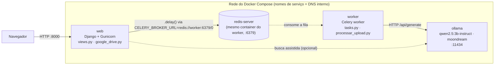

# Por Dentro Do BuscaÁgil

Guia técnico do código: o que cada peça faz, como Django, Celery, Redis,
Ollama e o Google Drive conversam entre si dentro do Docker, e **por que**
o projeto foi montado assim — não só o quê, mas o porquê de cada decisão.

Pra instalar/rodar veja o [README.md](README.md); pra usar o sistema veja o
[GUIA_DE_USO.md](GUIA_DE_USO.md). Este documento é sobre como o código por
dentro funciona.

**Stack**: Django 5.2 · Celery 5.4 · Redis · Docker Compose · Ollama (IA
local) · Gemini API · Google Drive API · django-allauth · rapidfuzz

## Sumário

1. [Visão geral](#1-visão-geral)
2. [Containers e como eles se falam](#2-containers-e-como-eles-se-falam)
3. [Do clique em "Enviar" até o Drive](#3-do-clique-em-enviar-até-o-drive)
4. [Login com Google e o Drive como storage](#4-login-com-google-e-o-drive-como-storage)
5. [O catálogo local: cache, não banco de dados](#5-o-catálogo-local-cache-não-banco-de-dados)
6. [Classificação: local primeiro, nuvem como rede de segurança](#6-classificação-local-primeiro-nuvem-como-rede-de-segurança)
7. [Motor de busca: um critério, dois lugares](#7-motor-de-busca-um-critério-dois-lugares)
8. [Segurança](#8-segurança)
9. [Frontend: HTML solto, sem build step](#9-frontend-html-solto-sem-build-step)
10. [Produção: o mesmo compose, um override](#10-produção-o-mesmo-compose-um-override)
11. [Mapa de arquivos](#11-mapa-de-arquivos)

---

## 1. Visão geral

BuscaÁgil é um buscador pessoal de arquivos. O usuário entra só com a conta
Google, envia arquivos (ou cola links), e o sistema guarda tudo no
**Google Drive do próprio usuário** — não num servidor nosso — classificando
cada item por IA (categoria, tags, descrição) pra depois ser possível
buscar por assunto, não só por nome de arquivo.

> **Decisão central**: o Drive do usuário é a **fonte da verdade**. O
> BuscaÁgil nunca guarda o conteúdo do arquivo em disco de longo prazo —
> `media/` é só o pouso temporário entre o upload e o envio pro Drive,
> apagado assim que o worker confirma. Isso significa: sem custo de storage
> pro lado do BuscaÁgil, e o usuário nunca perde acesso aos próprios
> arquivos mesmo que o BuscaÁgil saia do ar.

| Onde mora | O quê | Por quê |
|---|---|---|
| Google Drive | Arquivo real + `uploaded_files.json` | Fonte da verdade, dono é o usuário |
| `data/users/<id>.json` | Cópia do catálogo | Cache local — responde rápido sem bater no Drive a cada tela |
| `db.sqlite3` | Sessão, conta Google, tokens OAuth | Só o que é infraestrutura do próprio Django/allauth |
| `media/` | Arquivo enviado, por segundos | Pouso temporário até subir pro Drive |

---

## 2. Containers e como eles se falam

Três containers sobem via `docker-compose.yml`: `web` (Django), `worker`
(Celery) e `ollama` (IA local). Cada um tem um papel — e a forma como eles
se conectam tem uma decisão pouco óbvia: **não existe um serviço Redis
separado**.



`web` enfileira tarefas via Redis, mas o Redis não é um serviço próprio: ele
roda *dentro* do container `worker` (`worker/entrypoint.sh` sobe o
`redis-server` antes do Celery). Os outros containers alcançam ele pelo
nome do serviço, `worker:6379`, resolvido pelo DNS interno do Docker
Compose.

> **Por que redis embutido**: menos peça pra manter num app self-hosted de
> um usuário só. Em vez de orquestrar um quarto serviço só pra fila de
> tarefas, o próprio container que consome a fila também a hospeda.

> **Trade-off**: isso só funciona bem com **uma réplica** de `worker`. Se um
> dia for preciso escalar o processamento horizontalmente (mais de um
> worker em paralelo), cada réplica teria seu próprio Redis isolado — nesse
> ponto vale extrair um serviço `redis` de verdade no compose.

```sh
# worker/entrypoint.sh
# sobe o Redis embutido ANTES do worker do Celery — na mesma casca de processo
redis-server --daemonize yes --save "" --dir /tmp --bind 0.0.0.0 --protected-mode no
exec celery -A busca_agil worker --loglevel=info
```

```yaml
# docker-compose.yml
web:
  environment:
    CELERY_BROKER_URL: redis://worker:6379/0   # "worker" = nome do serviço, não localhost
    CELERY_RESULT_BACKEND: redis://worker:6379/0
  depends_on: [ollama, worker]

worker:
  entrypoint: ["sh", "/app/worker/entrypoint.sh"]
  environment:
    OLLAMA_BASE_URL: http://ollama:11434          # idem: "ollama" resolvido pela rede do compose
```

Sem `CELERY_BROKER_URL` definido, `busca_agil/settings.py` cai no default
`redis://localhost:6379/0` — e dentro do próprio container `worker` isso
bate certinho no Redis local que o `entrypoint.sh` acabou de subir. O `web`
só precisa sobrescrever porque, do ponto de vista dele, o Redis mora noutro
container.

---

## 3. Do clique em "Enviar" até o Drive

O upload em si é rápido: o navegador manda o arquivo, o Django devolve
`"processing"` na hora e a classificação + envio real pro Drive acontecem
em segundo plano, no worker.

1. **Navegador envia o arquivo via XHR** — `upload.js` usa
   `XMLHttpRequest` (não `fetch`) especificamente pra ter a barra de
   progresso via `xhr.upload.onprogress`.
2. **`POST /upload`** — `core/views.py::upload_files` salva o arquivo em
   `media/` (pouso temporário), cria a entry no catálogo com
   `status="processing"`, e enfileira
   `classify_and_catalog_task.delay(...)` — devolve a resposta pro
   navegador **sem esperar** a classificação terminar.
3. **Celery entrega a tarefa pro worker** — a tarefa vai pra fila no Redis;
   o processo `web` segue livre pra atender outras requisições.
4. **Worker classifica** — `core/tasks.py::_run_file_upload` chama
   `processar_upload()`: tenta IA local (Ollama) primeiro se habilitada,
   cai pro Gemini em qualquer falha (ver [seção 6](#6-classificação-local-primeiro-nuvem-como-rede-de-segurança)).
5. **Upload real pro Drive** — `google_drive.upload_file()`. Só agora o
   conteúdo sai da máquina que roda o BuscaÁgil e vai pro Drive do usuário.
6. **Catálogo atualizado e sincronizado de volta** —
   `uploaded_files_store.update_entry()` grava categoria/tags/
   descrição/scores no cache local; `sync_catalog_to_drive()` sobe o
   `uploaded_files.json` atualizado pro Drive. O arquivo temporário em
   `media/` é apagado.
7. **Navegador descobre que terminou via polling** —
   `task-notifications.js` consulta `GET /files/<id>/status`
   periodicamente até o status virar `"done"` ou `"error"` — funciona mesmo
   se o usuário sair da tela de upload e navegar pra outro lugar.

> **Por que assíncrono**: classificar por IA (principalmente vídeo, que
> passa por transcrição + várias legendas de cena) pode levar de segundos a
> minutos. Bloquear a requisição HTTP até isso terminar deixaria o
> navegador travado e arriscaria timeout — a fila do Celery desacopla "o
> arquivo chegou" de "o arquivo foi entendido".

```python
# core/views.py
try:
    async_result = classify_and_catalog_task.delay(
        request.user.id, saved_name, storage.path(saved_name), uploaded_file.name
    )
    entry_status = "processing"
except Exception as exc:
    # Broker (Redis) fora do ar não pode fazer o arquivo já salvo em
    # media/ sumir sem deixar rastro — sem isso, a entry nunca era
    # criada e o arquivo ficava órfão, invisível em qualquer tela.
    entry_status = "error"
```

Mesmo a fila do Celery falhando (Redis fora do ar) não pode fazer o upload
desaparecer silenciosamente — o arquivo já está salvo, então a entry é
criada de qualquer jeito, só que com status de erro visível.

---

## 4. Login com Google e o Drive como storage

Não existe usuário/senha do BuscaÁgil. O login é feito por `django-allauth`
contra o provedor Google, e — crucialmente — **o mesmo consentimento** já
pede acesso a uma pasta no Drive do usuário. Não há uma segunda tela de
"autorizar o Drive".

```python
# busca_agil/settings.py
SOCIALACCOUNT_PROVIDERS = {
    "google": {
        # drive.file: só dá acesso aos arquivos que o próprio BuscaÁgil cria
        # no Drive do usuário — não enxerga o resto do Drive dele.
        "SCOPE": ["profile", "email", "https://www.googleapis.com/auth/drive.file"],
        # access_type=offline + prompt=consent garantem que o Google sempre
        # devolva um refresh_token, necessário pro worker Celery conseguir
        # subir arquivos pro Drive fora do ciclo de vida do login.
        "AUTH_PARAMS": {"access_type": "offline", "prompt": "consent"},
    }
}
```

> **Por que `drive.file`, não `drive`**: o escopo completo (`drive`)
> enxergaria — e poderia apagar — qualquer arquivo do Drive do usuário.
> `drive.file` restringe o app a só os arquivos que ele mesmo criou. É o
> princípio do menor privilégio aplicado a uma integração OAuth: um bug no
> BuscaÁgil não vira um jeito de destruir os documentos pessoais de outra
> parte da vida do usuário.

Depois do login, `core/views.py::post_login_sync` roda antes de qualquer
página carregar:

1. **Garante a pasta** — `google_drive.ensure_app_folder()` cria
   `buscaagil_upload/` na raiz do Drive se ainda não existir.
2. **Baixa o catálogo** — `download_catalog()` lê o `uploaded_files.json`
   de dentro dessa pasta (se o usuário já usou o sistema antes de outro
   dispositivo, por exemplo).
3. **Espelha localmente** — `uploaded_files_store.write_all()` grava esse
   catálogo em `data/users/<id>.json` — as próximas telas leem daqui, não
   do Drive.

Se qualquer passo falhar (token sem escopo, API do Drive fora do ar), o
usuário é redirecionado pra `auth.html` em vez de um erro 500 — com um
botão que força o Google a pedir consentimento de novo
(`prompt=consent`).

---

## 5. O catálogo local: cache, não banco de dados

Cada usuário tem um arquivo `data/users/<id>.json` — um espelho do
`uploaded_files.json` que vive de verdade no Drive dele. É lido a cada
`GET /files` e reescrito a cada upload, edição ou exclusão.

> **Por que JSON num arquivo, não SQLite/Postgres**: o Drive já *é* a fonte
> da verdade — colocar os arquivos também numa tabela relacional
> duplicaria a sincronização (Drive ↔ banco) sem necessidade real pro
> volume de um catálogo pessoal (dezenas a milhares de itens, não
> milhões). Um dict Python lido inteiro na memória é suficiente, e mais
> simples de espelhar 1:1 com o formato que já é salvo no Drive.

O risco óbvio dessa escolha — dois processos (o `web` respondendo ao
polling do navegador, e o `worker` escrevendo o resultado da
classificação) mexendo no mesmo arquivo ao mesmo tempo — é resolvido com um
lock por usuário:

```python
# core/uploaded_files_store.py
def update_entry(user_id: int | str, entry_id: str, **fields) -> dict | None:
    """Atualiza campos de uma entry existente (usado pelos workers Celery ao
    terminar a classificação/upload assíncronos)."""
    with FileLock(_lock_path(user_id), timeout=_LOCK_TIMEOUT_SECONDS):
        files = _read_json(user_id)
        entry = next((f for f in files if f["id"] == entry_id), None)
        if entry is None:
            return None
        entry.update(fields)
        _write_json(user_id, files)
        return entry
```

`FileLock` (lib `filelock`) garante que o "ler tudo → alterar um item →
reescrever tudo" seja atômico entre processos — sem isso, uma leitura do
polling no meio de uma escrita do worker poderia corromper o JSON ou
perder uma edição.

> **Trade-off aceito**: sem índice nem consulta SQL — toda busca/filtro é
> `O(n)` sobre a lista completa carregada em memória (ver
> [seção 7](#7-motor-de-busca-um-critério-dois-lugares)). Ótimo pra um
> catálogo pessoal; não escalaria pra um catálogo compartilhado de milhões
> de arquivos.

---

## 6. Classificação: local primeiro, nuvem como rede de segurança

Todo arquivo (ou link) enviado passa por `scripts/processar_upload.py`,
que tenta classificar com Ollama (container local, grátis, sem sair da
máquina) e só cai pro Gemini (API paga/cota) se a IA local estiver
desligada ou falhar.

| Formato | Caminho Ollama (local) | Caminho Gemini (nuvem) |
|---|---|---|
| Texto / planilha / docx | Extraído como texto, classificado direto | Igual |
| Imagem / PDF | **2 etapas**: `moondream` gera legenda em texto → modelo de texto classifica a legenda | 1 etapa: Gemini processa o arquivo nativo direto |
| Vídeo / áudio | `faster-whisper` transcreve + 3 frames legendados por `moondream` | Não suportado — capacidade só da IA local |

> **Por que 2 etapas na visão local**: `moondream` é um modelo de visão
> pequeno (~1.8B, roda em CPU) — leve demais pra seguir com confiança um
> schema JSON de 4 campos. Em vez disso, ele só descreve a imagem em texto
> livre, e essa legenda é classificada pelo mesmo prompt/modelo de texto
> (`qwen2.5:3b-instruct`) usado pra documentos — reaproveitando um único
> "classificador de texto" pra tudo.

```python
# scripts/processar_upload.py
def processar_upload(origem: str) -> dict:
    if local_ai_habilitada():
        try:
            return classificar_local(origem, CATEGORIAS_POSSIVEIS)
        except Exception as exc:  # noqa: BLE001 - IA local é best-effort, cai pro Gemini
            logger.warning("IA local não conseguiu classificar '%s', caindo pro Gemini: %s", origem, exc)

    conteudo = preparar_conteudo(origem)
    classificacao = GeminiCategorizer().classificar(conteudo, CATEGORIAS_POSSIVEIS)
    return {
        "categoria_principal": classificacao.categoria_principal,
        "tags": classificacao.tags,
        "descricao": classificacao.descricao,
        "scores": {item.categoria: item.score for item in classificacao.scores},
    }
```

Os dois caminhos (local e Gemini) devolvem exatamente o mesmo formato de
dict — quem chama essa função (`core/tasks.py`) nunca precisa saber qual
dos dois respondeu.

### Scores de confiança viram sinal na tela

O modelo (local ou Gemini) responde com um score de 0 a 1 *pra cada
categoria candidata*, via *structured output* (schema Pydantic, sem
parsing manual de texto livre). O `core/tasks.py` guarda o score da
categoria escolhida como `confidence` — quando fica abaixo de `0.55`, um
selo laranja aparece na interface convidando o usuário a revisar, em vez
de confiar cegamente numa classificação duvidosa.

```python
# scripts/categorizer_gemini.py
class ClassificacaoArquivo(BaseModel):
    categoria_principal: str
    tags: List[str]        # 3–6 palavras-chave do CONTEÚDO, não da categoria
    descricao: str
    scores: List[_CategoriaScore]   # um score por categoria candidata
```

`response_mime_type="application/json"` + `response_schema=ClassificacaoArquivo`
força o Gemini a responder nesse formato exato — a mesma classe Pydantic é
reaproveitada pelo caminho local (`categorizer_local.py`), pedindo o JSON
por prompt em vez de via API nativa.

---

## 7. Motor de busca: um critério, dois lugares

A busca combina duas camadas: a IA sugere quais categorias/tags do
catálogo provavelmente correspondem à consulta
(`scripts/analisador_busca.py`), e um critério de *matching* local decide,
arquivo por arquivo, se isso conta como resultado.

> **Por que existe `core/text_match.py`**: esse critério de match precisa
> rodar em **dois lugares diferentes**: no backend (Python, filtro final de
> `smart_search`) e no frontend (JS, fallback usado quando a query está
> vazia ou a chamada ao backend falha). Ter a lógica implementada duas
> vezes, de formas diferentes, significava que a mesma busca podia dar
> resultados diferentes dependendo de qual caminho respondia — por isso os
> dois lados seguem exatamente o mesmo critério em camadas, só numa
> linguagem diferente (rapidfuzz em Python, Levenshtein escrito à mão em
> JS).

1. **Categoria exata** — categoria do arquivo bate (sem acento/caixa) com
   uma categoria sugerida pela IA → **score 100**.
2. **Tag exata** — uma tag do arquivo bate exatamente com uma tag sugerida
   → **score 98**.
3. **Tag aproximada na descrição/nome** — uma tag sugerida aparece (com
   typo/acento) na descrição ou nome do arquivo → score pelo fuzzy.
4. **Fuzzy geral** — a consulta inteira é comparada, tolerando erro de
   digitação, contra nome + descrição + categoria + tags concatenados.

Resultado abaixo de `80` (de 0–100) não entra na lista — e os que entram
são **ordenados por esse score**, não pela ordem crua do catálogo.

```python
# core/text_match.py
def normalize(text: str | None) -> str:
    decomposed = unicodedata.normalize("NFKD", text or "")
    without_accents = "".join(ch for ch in decomposed if not unicodedata.combining(ch))
    return without_accents.lower().strip()

def fuzzy_score(query: str | None, candidate: str | None) -> float:
    """0-100: o quanto `query` aparece (mesmo com erro de digitação) dentro
    de `candidate`. Usa partial_ratio pra não penalizar candidate ser mais
    longo que a query (ex.: query="fatura", candidate="fatura de março")."""
    q, c = normalize(query), normalize(candidate)
    return fuzz.partial_ratio(q, c) if q and c else 0.0
```

"relatório" e "relatorio" comparam iguais (`normalize`); "fechametno"
(erro de digitação) ainda encontra "fechamento" (`partial_ratio` do
rapidfuzz, algoritmo Levenshtein otimizado em C).

---

## 8. Segurança

### CSRF: cookie na página, token no header

Como as páginas são HTML "soltas" (sem herança de template Django, sem
`` em lugar nenhum), o cookie de CSRF não era setado — e
os endpoints que alteram dado viviam marcados `@csrf_exempt` pra
compensar. Isso foi corrigido: toda página força o cookie a existir, e o
JavaScript manda o token de volta em todo `POST`.

```python
# core/views.py
def _render_page(request, template_name: str):
    # get_token() força o cookie "csrftoken" a ser setado nesta resposta,
    # em todas as páginas de uma vez, sem decorar view por view.
    get_token(request)
    return render(request, template_name)
```

```javascript
// static/js/catalog-client.js
function getCsrfToken() {
  const match = document.cookie.match(/(?:^|;\s*)csrftoken=([^;]+)/);
  return match ? decodeURIComponent(match[1]) : "";
}
```

Usado em todo `fetch`/`XMLHttpRequest` que altera dado — upload, adicionar
link, editar classificação, excluir arquivo. Sem o header `X-CSRFToken`
certo, o `CsrfViewMiddleware` do Django recusa com `403`.

### Trava de produção em `settings.py`

Subir com `DJANGO_DEBUG=false` sem uma `SECRET_KEY` ou `ALLOWED_HOSTS`
reais não falha silenciosamente — o Django recusa subir de propósito:

```python
# busca_agil/settings.py
if not DEBUG and SECRET_KEY.startswith("django-insecure-"):
    raise RuntimeError(
        "DJANGO_DEBUG=false mas DJANGO_SECRET_KEY não foi definida — gere uma "
        "chave segura ... antes de rodar em produção."
    )
```

Um erro alto e explícito no boot é preferível a um site em produção com a
chave de exemplo do repositório público.

---

## 9. Frontend: HTML solto, sem build step

Não há React/Vue nem bundler. Cada tela é um template Django standalone
que carrega scripts simples via `<script src>`, direto — o "estado" é um
array em memória (`MOCK_FILES`) populado por `fetch` quando a página abre.

> **Por que não um framework**: pro tamanho da interface (8 telas, sem
> interação complexa entre componentes), um bundler adicionaria uma etapa
> de build só pra editar um botão — o fluxo atual é editar o `.js`,
> recarregar a página (o bind-mount do Docker já reflete a mudança na
> hora, sem rebuild de imagem). O custo é real — funções e HTML se repetem
> entre `dashboard.js`, `search.js` e `file-view.js` — mas
> `catalog-client.js` concentra o que é genuinamente compartilhado.

| Função em `catalog-client.js` | Usada por |
|---|---|
| `loadUploadedFiles()` | Toda tela que lista arquivos |
| `smartSearchFiles()` | dashboard, busca dedicada |
| `searchFiles()` (fallback local com fuzzy) | quando a busca no backend falha/está vazia |
| `isLowConfidence()` | badge de "revisar classificação" nos cards |
| `getCsrfToken()` | todo `POST` que altera dado |

Um só dicionário (`FILE_TYPES`) define ícone e cor por tipo de arquivo —
reaproveitado em todo lugar que desenha um card, do dashboard ao resultado
de busca: `image`, `pdf`, `video`, `doc`, `sheet`, `link`, `audio`,
`archive`.

---

## 10. Produção: o mesmo compose, um override

`docker-compose.yml` sobe `runserver` — o servidor de desenvolvimento do
Django, deliberadamente simples pra editar-e-recarregar. Em produção, um
segundo arquivo é somado por cima:

```bash
docker compose -f docker-compose.yml -f docker-compose.prod.yml up -d --build
```

```yaml
# docker-compose.prod.yml
services:
  web:
    command: >
      sh -c "python manage.py migrate &&
             python manage.py collectstatic --noinput &&
             gunicorn busca_agil.wsgi:application --bind 0.0.0.0:8000 --workers 3"
    restart: always
```

Gunicorn no lugar do `runserver`; `collectstatic` junta tudo de `static/`
em `staticfiles/`, de onde o `WhiteNoiseMiddleware` passa a servir —
comprimido, com cache headers — sem precisar configurar isso num Nginx à
parte.

O checklist completo (gerar `SECRET_KEY`, restringir `ALLOWED_HOSTS`,
exemplo de bloco Nginx pra TLS) está no [README.md](README.md), seção
"Checklist De Produção".

---

## 11. Mapa de arquivos

```text
busca_agil/               # projeto Django: settings, urls, celery.py
core/                      # app principal
  views.py                 rotas HTTP — páginas, upload, busca, exclusão
  tasks.py                 tarefas assíncronas do Celery
  google_drive.py          toda a integração com a Drive API
  uploaded_files_store.py  cache local por usuário, com file lock
  text_match.py            critério único de busca (acento + fuzzy)
  models.py                DriveProfile — só referências, não dado de negócio
scripts/
  processar_upload.py      orquestra local → Gemini
  categorizer_gemini.py    classificação via API do Gemini
  analisador_busca.py      interpreta a query de busca via Gemini
  extrator_conteudo.py     extrai texto de cada formato de arquivo
  local_ai/                # equivalentes locais, mesmo shape de retorno
    router.py               decide texto/imagem/vídeo, liga com o Gemini
    ollama_client.py        cliente HTTP fino pro container Ollama
    categorizer_local.py
    video_local.py          ffmpeg + faster-whisper
static/js/
  catalog-client.js        estado compartilhado + busca local + CSRF
  dashboard.js · search.js · file-view.js · upload.js · profile.js
worker/
  entrypoint.sh             sobe redis-server embutido + celery worker
docker-compose.yml         # dev: web + worker + ollama
docker-compose.prod.yml    # override: Gunicorn + WhiteNoise
```

---

*Documento de arquitetura do BuscaÁgil — gerado a partir do código-fonte
do projeto. Reflete o estado do repositório no momento em que foi
escrito.*
